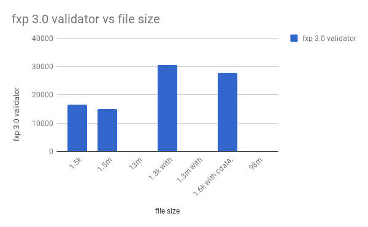
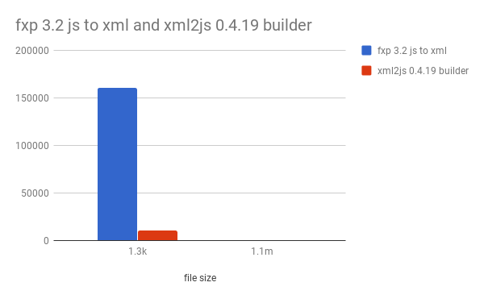

# [fast-xml-parser](https://www.npmjs.com/package/fast-xml-parser)
Validate XML or Parse XML to JS/JSON very fast without C/C++ based libraries and no callback

<p style="color:red;"> **Note**: If you are using v3, your code may start failing in parsing and validation both. I apologize for the breaking changes. But code was supposed to be changed to support large files and many other options. Please refer the code example below for more detail.</p>
You can use this library online (press try me button above), or as command from CLI, or in your website, or in npm repo.

* This library let you validate the XML data syntactically. 
* Or you can transform/covert/parse XML data to JS/JSON object.
* Or you can transform the XML in traversable JS object which can later be converted to JS/JSON object.

[](https://codeclimate.com/github/NaturalIntelligence/fast-xml-parser) 
[](https://www.paypal.com/cgi-bin/webscr?cmd=_s-xclick&hosted_button_id=KQJAX48SPUKNC) 
<a href="https://liberapay.com/amitgupta/donate"></a> 
[](https://snyk.io/test/github/naturalintelligence/fast-xml-parser) 
[![NPM quality][quality-image]][quality-url]
[](https://travis-ci.org/NaturalIntelligence/fast-xml-parser) 
[](https://coveralls.io/github/NaturalIntelligence/fast-xml-parser?branch=master) 
[](https://naturalintelligence.github.io/fast-xml-parser/)
[](https://www.bithound.io/github/NaturalIntelligence/fast-xml-parser/master/dependencies/npm)
[](https://www.bithound.io/github/NaturalIntelligence/fast-xml-parser) 
[](https://npm.im/fast-xml-parser)

[quality-image]: http://npm.packagequality.com/shield/fast-xml-parser.svg?style=flat-square
[quality-url]: http://packagequality.com/#?package=fast-xml-parser

<a href="https://opencollective.com/fast-xml-parser/donate" target="_blank">
  
</a>

### Main Features

* Works with node packages, in browser, and in CLI
* Faster than any pure JS implementation.
* It can handle big files (tested up to 100mb).
* You can parse CDATA as separate property.
* You can prefix attributes or group them to separate property. Or can ignore them from result completely.
* You can parse tag's or attribute's value to premitive type: string, integer, float, or boolean. And can optionally decode for HTML char.
* You can remove namespace from tag or attribute name while parsing
* It supports boolean attributes, if configured.


### How to use
**Installation**

`$npm install fast-xml-parser`

or using [yarn](https://yarnpkg.com/)

`$yarn add fast-xml-parser`

**Usage**
```js
var fastXmlParser = require('fast-xml-parser');
var jsonObj = fastXmlParser.parse(xmlData);

/* upto 2.9.x
var options = {
    attrPrefix : "@_",
    attrNodeName: false,
    textNodeName : "#text",
    ignoreNonTextNodeAttr : true,
    ignoreTextNodeAttr : true,
    ignoreNameSpace : true,
    ignoreRootElement : false,
    textNodeConversion : true,
    textAttrConversion : false,
    arrayMode : false
};
*/
//from 3.0.0
var options = {
    attributeNamePrefix : "@_",
    attrNodeName: "attr", //default is 'false'
    textNodeName : "#text",
    ignoreAttributes : true,
    ignoreNameSpace : false,
    allowBooleanAttributes : false,
    parseNodeValue : true,
    parseAttributeValue : false,
    trimValues: true,
    decodeHTMLchar: false,
    cdataTagName: "__cdata", //default is 'false'
    cdataPositionChar: "\\c",
};
if(fastXmlParser.validate(xmlData)=== true){//optional
	var jsonObj = fastXmlParser.parse(xmlData,options);
}

//Intermediate obj
var tObj = fastXmlParser.getTraversalObj(xmlData,options);
var jsonObj = fastXmlParser.convertToJson(tObj,options);

```
**OPTIONS** :

* **attributeNamePrefix** : prepend given string to attribute name for identification
* **attrNodeName**: (Valid name) Group all the attributes as properties of given name.  
* **ignoreAttributes** : Ignore attributes to be parsed.
* **ignoreNameSpace** : Remove namespace string from tag and attribute names. 
* **allowBooleanAttributes** : a tag can have attributes without any value
* **parseNodeValue** : Parse the value of text node to float, integer, or boolean.
* **parseAttributeValue** : Parse the value of an attribute to float, integer, or boolean.
* **trimValues** : trim string values of an attribute or node
* **decodeHTMLchar** : decodes any named and numerical character HTML references excluding CDATA part.
* **cdataTagName** : If specified, parser parse CDATA as nested tag instead of adding it's value to parent tag.
* **cdataPositionChar** : It'll help to covert JSON back to XML without loosing CDATA position.

To use from command line
```bash
$xml2js [-ns|-a|-c] <filename> [-o outputfile.json]
$cat xmlfile.xml | xml2js [-ns|-a|-c] [-o outputfile.json]
```

-ns : To include namespaces (bedefault ignored)
-a : To ignore attributes
-c : To ignore value conversion (i.e. "-3" will not be converted to number -3)

To use it **on webpage**

1. Download and include [parser.js] Or use directly from [CDN](https://cdnjs.com/libraries/fast-xml-parser)(https://github.com/NaturalIntelligence/fast-xml-parser/blob/master/lib/parser.js)
```js
var result = parser.validate(xmlData);
if(result !== true) cnosole.log(result.err);
var jsonObj = parser.parse(xmlData);
```

## JSON or JS Object to XML

```js
var Parser = require("fast-xml-parser").j2xParser;
//default options need not to set
var defaultOptions = {
    attributeNamePrefix : "@_",
    attrNodeName: "@", //default is set to false
    textNodeName : "#text",
    ignoreAttributes : true,
    encodeHTMLchar: false,
    cdataTagName: "__cdata", //default is set to false
    cdataPositionChar: "\\c",
    format: false, 
    indentBy: "  ",
    supressEmptyNode: false
};
var parser = new Parser(defaultOptions);
var xml = parser.parse(json_or_js_obj);

```
**OPTIONS** :


* **attributeNamePrefix** : Identify attributes with this prefix otherwise treat them as a tag.
* **attrNodeName**: Identify attributes with this name when they are grouped under single property.  
* **ignoreAttributes** : Don't check for attributes. Treats everything as tag.
* **encodeHTMLchar** : encodes values (except cdata values) when writing to XML.
* **cdataTagName** : If specified, parse matching tag as CDATA
* **cdataPositionChar** : Identify the position where CDATA tag should be placed. If it is blank then CDATA will be added in the last of tag's value.
* **format** : If set to true, then format the XML output.
* **indentBy** : indent by this char `when` format is set to `true` 
* **supressEmptyNode** : If set to `true`, tags with no value (text or nested tags) are written as self closing tags. 

## Comparision
I decided to created this library when I couldn't find any library which can convert XML data to json without any callback and which is not based on any C/C++ library.

Libraries that I compared
* xml-mapping : fast, result is not satisfactory
* xml2js : fast, result is not satisfactory
* xml2js-expat : couldn't test performance as it gives error on high load. Installation failed on travis and on my local machine using 'yarn'.
* xml2json : based on node-expat which is based on C/C++. Installation failed on travis.
* fast-xml-parser : very very fast.

Why not C/C++ based libraries?
Installation of such libraries fails on some OS. You may require to install missing dependency manually.

### Benchmark report

| file size | fxp 3.0 validator (rps) | fxp 3.0 parser (rps) | xml2js 0.4.19 (rps) |
| ---------- | ----------------------- | ------------------- | ------------------- |
| 1.5k | 16581.06758 | 14032.09323 | 4615.930805 |
| 1.5m | 14918.47793 | 13.23366098 | 5.90682005 |
| 13m | 1.834479235 | 1.135582008 | -1 |
| 1.3k with CDATA | 30583.35319 | 43160.52342 | 8398.556349 |
| 1.3m with CDATA | 27.29266471 | 52.68877009 | 7.966000795 |
| 1.6k with cdata,prolog,doctype | 27690.26082 | 41433.98547 | 7872.399268 |
| 98m | 0.08473858148 | 0.2600104004 | -1 |

* -1 indicates error or incorrect output.




#### Benchmark for JSON to XML

| file size | fxp 3.2 js to xml | xml2js 0.4.19 builder |
|------------|-----------------|-----------------|
| 1.3k | 160148.9801 | 10384.99401|
| 1.1m | 173.6374831 | 8.611884025|


# Changes from v3

* It can handle big file now (I have tested up to 98mb). Performance report is given above.
* Meaningful error messages from validator

```
"err": {
    "code": "InvalidAttr",
    "msg": "Attributes for rootNode have open quote"
}
```

* Updated options : check snippet aboove
* Parse boolean values as well. E.g. `"true"` to `true` 
* You can set pasrer not to *trim* whitespaces from attribute or tag /node value.
* You can set pasrer to HTML decode Tag / node and attribute values. However CDATA value will not be HTML decoded.
* Tag / node value will not be parsed if CDATA presents.
* You can set validator and parser to allow boolean values.
* Few validation and parsing bugs are also fixed


### Worth to mention

 - [stubmatic](https://github.com/NaturalIntelligence/Stubmatic) : A stub server to mock behaviour of HTTP(s) / REST / SOAP services. Stubbing redis is on the way.
 - **[fastify-xml-body-parser](https://github.com/NaturalIntelligence/fastify-xml-body-parser/)** : Fastify plugin / module to parse XML payload / body into JS object using fast-xml-parser.
  - [fast-lorem-ipsum](https://github.com/amitguptagwl/fast-lorem-ipsum) : Generate lorem ipsum words, sentences, paragraph very quickly.

